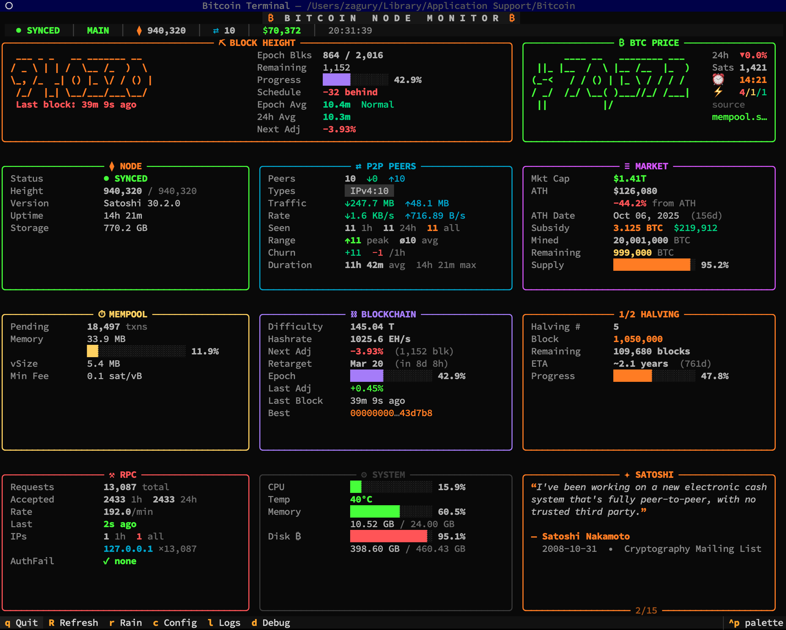
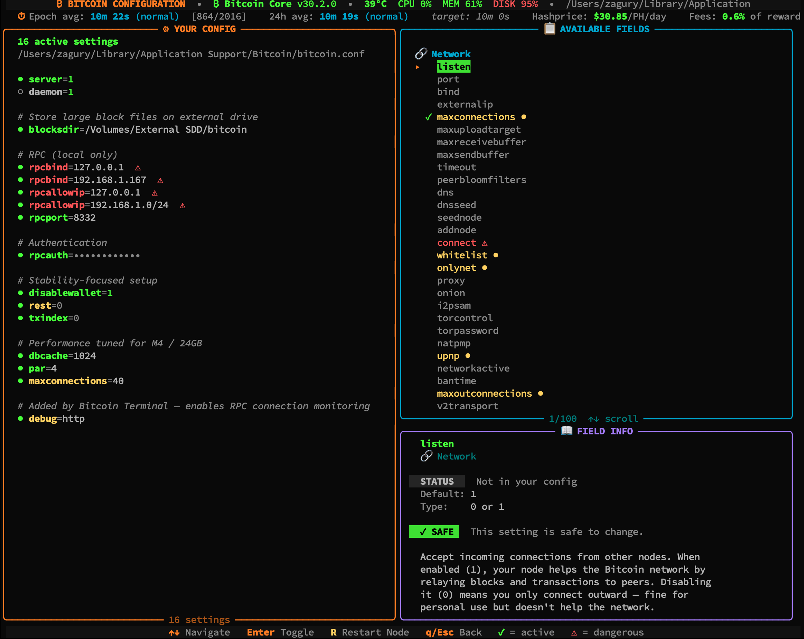

<div align="center">

# ₿ Bitcoin Terminal

**A real-time Bitcoin node monitor for your terminal.**

Twelve live dashboard cards, a full `bitcoin.conf` editor, Matrix Rain new-block animations, and zero browser windows required.

[](LICENSE)
[](https://www.python.org/)
[](https://bitcoin.org)
[](https://github.com/CRTao/bitcoin-terminal)
[]()
[]()
[](https://textual.textualize.io/)
[](https://bitcoincore.org/)

</div>

---

<div align="center">



*Live dashboard monitoring a Bitcoin Core node — block height with epoch stats, BTC price, peers, mempool, blockchain, halving countdown, and more.*

</div>

---

## Features

| Category | What you get |
|----------|-------------|
| **12 Live Cards** | Price, Block Height, Node, P2P Peers, Market, Mempool, Blockchain, Halving, RPC, System, Satoshi Quotes — all updating every 5 s |
| **Status Bar** | Sync status, chain, block height, peers, BTC price, hashprice, epoch avg block time, fee % of reward — always visible at the top |
| **Hero Row** | Large ASCII-art BTC price (2-col span) + block height via pyfiglet |
| **Config Editor** | Browse 100+ `bitcoin.conf` fields by category, toggle with Enter, danger-level warnings, implementation-aware (Core / Knots) |
| **Matrix Rain** | Full-screen katakana rain on new blocks, on startup, or on demand |
| **Log Viewer** | Live `debug.log` tail with color-coded categories and noise filtering |
| **Setup Wizard** | 7-step guided first-run: auto-detect datadir → scan RPC ports → test connection → configure display |
| **Peer Intelligence** | Historical peer tracking, churn detection, bandwidth rates, security alerts |
| **RPC Monitor** | Request rates, method frequency, auth failure tracking from `debug.log` |
| **System Health** | CPU %, temperature, memory, disk (root + data drive) |
| **Price Data** | CoinGecko primary + mempool.space fallback, persistent disk cache |
| **Mining Stats** | Hashprice ($/PH/day) on price card + status bar, fee % of reward on blockchain card + status bar, difficulty adjustment countdown, hashrate ATH & drawdown |
| **Auto-Detection** | Finds Bitcoin data directories on macOS / Linux / Windows, cookie auth, external drives |

---

## Quick Start

**One command — installs everything and launches the setup wizard:**

```bash
curl -sL https://raw.githubusercontent.com/CRTao/bitcoin-terminal/main/install.sh | bash
```

This will:
1. Check for Python 3.8+ and git
2. Clone the repo to `~/bitcoin-terminal`
3. Create a virtual environment and install dependencies
4. Launch the setup wizard, which auto-detects your node and configures everything

> **Prerequisite:** A running Bitcoin Core node with `server=1` in `bitcoin.conf`. That's it.

<details>
<summary><strong>Manual install</strong></summary>

```bash
git clone https://github.com/CRTao/bitcoin-terminal.git
cd bitcoin-terminal
./run.sh
```

Or step by step:

```bash
git clone https://github.com/CRTao/bitcoin-terminal.git
cd bitcoin-terminal
python3 -m venv venv && source venv/bin/activate
pip install -r requirements.txt
python -m bitcoin_terminal
```

</details>

First launch runs the **setup wizard** automatically — it scans your system, finds your node, tests the RPC connection, and saves everything to `.env`.

---

## Installation

### Prerequisites

- **Python 3.8+**
- **Bitcoin Core** (or Knots / btcd / bcoin) running with `server=1`

### From source

```bash
git clone https://github.com/CRTao/bitcoin-terminal.git
cd bitcoin-terminal
python3 -m venv venv
source venv/bin/activate      # macOS / Linux
# venv\Scripts\activate       # Windows

pip install -r requirements.txt
```

### As a package

```bash
pip install -e .
bitcoin-terminal              # Now available as a command
```

### Dependencies

| Package | Purpose |
|---------|---------|
| `textual ≥0.50` | TUI framework |
| `rich ≥13.7` | Rich text rendering |
| `pyfiglet ≥1.0` | ASCII art (hero price / block height) |
| `psutil ≥5.9` | CPU, memory, disk, temperature |
| `python-dotenv ≥1.0` | `.env` configuration |
| `yaspin ≥3.0` | Spinner animations |

---

## Usage

```bash
# Launch (setup wizard on first run, dashboard on subsequent runs)
python -m bitcoin_terminal

# Re-run the setup wizard
python -m bitcoin_terminal --setup

# Point at a specific data directory
python -m bitcoin_terminal --datadir /path/to/bitcoin

# Scan for Bitcoin directories without launching
python -m bitcoin_terminal scan

# Force re-scan
python -m bitcoin_terminal --force-scan
```

### Keyboard Shortcuts

#### Dashboard

| Key | Action |
|-----|--------|
| `c` | Open Config Editor |
| `l` | Open Log Viewer |
| `r` | Trigger Matrix Rain |
| `R` | Force refresh + rotate Satoshi quote |
| `d` | Enable `debug=http` in bitcoin.conf |
| `q` | Quit |

#### Config Editor

| Key | Action |
|-----|--------|
| `↑ / k` | Navigate up |
| `↓ / j` | Navigate down |
| `PgUp / PgDn` | Jump 10 fields |
| `Enter` | Toggle field on/off in bitcoin.conf |
| `R` | Restart Bitcoin Core |
| `q / Esc` | Back (prompts to save if changed) |

#### Log Viewer

| Key | Action |
|-----|--------|
| `Home / End` | Jump to top / bottom |
| `l / Esc` | Back to dashboard |

---

## Dashboard Cards

### Row 0 — Hero

| Card | Description |
|------|-------------|
| **₿ BTC Price** | Large pyfiglet price, 24h change %, sats per dollar, Moscow Time, fee estimates (fast / medium / economy), hashprice ($/PH/day) |
| **⛏ Block Height** | Large pyfiglet block number, time since last block (green < 10m, yellow 10–20m, red > 20m), epoch stats |

### Row 1

| Card | Description |
|------|-------------|
| **⧫ Node** | Sync status + progress bar + ETA, height, version (subversion string), uptime, storage, pruned flag |
| **⇄ P2P Peers** | Total / in / out, network types (IPv4 / IPv6 / Tor / I2P), bandwidth, unique peers (1h / 24h / all), churn, security alerts |
| **≡ Market** | Market cap, ATH price + date + days since, block subsidy (BTC + USD), supply mined + remaining + progress bar |

### Row 2

| Card | Description |
|------|-------------|
| **⏱ Mempool** | Pending tx count, memory usage bar, vSize, min fee |
| **⛓ Blockchain** | Difficulty, hashrate, fee revenue as % of block reward, next-adjustment % + countdown + progress bar, last block time, best block hash |
| **½ Halving** | Next halving number, target block, remaining blocks, ETA, epoch progress bar |

### Row 3

| Card | Description |
|------|-------------|
| **⚒ RPC** | Request rates (1h / 24h), connection rate/min, unique IPs, top callers, top methods, auth failures + security alerts |
| **⚙ System** | CPU % bar + temperature, memory bar, root disk bar, data drive bar (if separate mount) |
| **✦ Satoshi** | Rotating Nakamoto quotes (15 quotes, cycles every 30s) with date + source |

---

## Config Editor

Press `c` from the dashboard to open the full-screen `bitcoin.conf` editor — a complete visual interface for configuring your Bitcoin node without manually editing files.

<div align="center">



*The built-in config editor — browse 100+ fields by category, toggle settings with Enter, and restart your node directly from the terminal.*

</div>

**Three panels:**
- **Left** — Your current `bitcoin.conf` (live parsed, sensitive values masked)
- **Right top** — All available fields organized by category, scrollable, with danger-level icons (🟢 safe, 🟡 caution, 🔴 dangerous)
- **Right bottom** — Detailed info for the highlighted field: description, default value, type, and danger level

**100+ fields** across 14 categories: Network, Mining, Wallet, RPC Server, Storage & Pruning, Relay & Mempool, Security, Debug & Logging, Chain Selection, Performance, Privacy, and Knots-specific fields.

**Implementation detection** — Automatically identifies Bitcoin Core, Bitcoin Knots, btcd, bcoin, or Libbitcoin from the node's subversion string and filters fields accordingly.

**Stats bar** — Epoch avg block time, 24h avg, hashprice, fee % of reward, hashrate ATH & drawdown (also shown on the main dashboard status bar).

**On exit with changes** — A dialog offers three choices: **Save & Restart Node** (stops via RPC, relaunches `bitcoind -daemon`), **Save Only**, or **Discard**.

---

## Setup Wizard

Runs automatically on first launch or with `--setup`. Seven steps:

1. **Welcome** — ASCII art banner and overview
2. **Detect** — Scans filesystem for Bitcoin data directories + probes RPC ports (8332, 18332, 18443, 38332)
3. **Data Directory** — Confirm detected dir or enter a custom path
4. **Connection** — Configure RPC host/port; auto-detects cookie auth and `bitcoin.conf` credentials
5. **Test** — Verifies RPC connection, shows chain/blocks/version/connections
6. **Settings** — Refresh interval (3–30 s)
7. **Summary** — Review all settings, save to `.env`, launch dashboard

---

## Configuration

All settings are stored in `.env` (git-ignored). Example:

```ini
BITCOIN_DATADIR=/Users/you/Library/Application Support/Bitcoin
BITCOIN_RPC_HOST=127.0.0.1
BITCOIN_RPC_PORT=8332
BITCOIN_RPC_USER=your_rpc_user
BITCOIN_RPC_PASSWORD=your_rpc_password
REFRESH_INTERVAL=5
THEME=dark
```

**RPC auth priority:** `.env` credentials → `bitcoin.conf` `rpcuser/rpcpassword` → `.cookie` file (auto-detected in datadir and chain subdirectories).

---

## Platform Support

| OS | Data directory detection | Tested |
|----|--------------------------|--------|
| macOS | `~/Library/Application Support/Bitcoin`, `~/.bitcoin`, `/Volumes/*` | ✅ |
| Linux | `~/.bitcoin`, `/mnt/*`, `/media/*`, `/data/bitcoin` | ✅ |
| Windows | `%APPDATA%/Bitcoin`, `C:/Bitcoin` | Partial |

---

## External APIs

| Provider | Data | Fallback |
|----------|------|----------|
| CoinGecko | Price, 24h change, market cap, ATH | mempool.space prices |
| mempool.space | Difficulty adjustment, hashrate, recommended fees, price fallback | Cached data (< 5 min) |

All requests use `BitcoinTerminal/0.1` user-agent. CoinGecko responses are cached to disk (`.price_cache.json`) and survive restarts.

---

## Project Structure

```
bitcoin-terminal/
├── bitcoin_terminal/
│   ├── __main__.py        # CLI entry point + setup wizard launcher
│   ├── tui.py             # Main dashboard (12 cards, grid layout)
│   ├── config_screen.py   # Config editor + save/restart dialog
│   ├── config_data.py     # 100+ bitcoin.conf field definitions
│   ├── rpc.py             # Bitcoin RPC client (cookie/password/rpcauth)
│   ├── data.py            # External API fetchers + price cache
│   ├── scanner.py         # Bitcoin directory auto-detection
│   ├── config.py          # .env configuration management
│   ├── setup_wizard.py    # First-run setup wizard
│   ├── log_view.py        # Live debug.log viewer
│   └── ansi_utils.py      # Terminal styling helpers
├── .env.example           # Configuration template
├── requirements.txt
├── setup.py
└── LICENSE                # MIT
```

---

## Contributing

See [CONTRIBUTING.md](CONTRIBUTING.md) for development setup, coding standards, and PR guidelines.

---

## License

[MIT](LICENSE) — Copyright (c) 2026 Bitcoin Terminal Contributors
